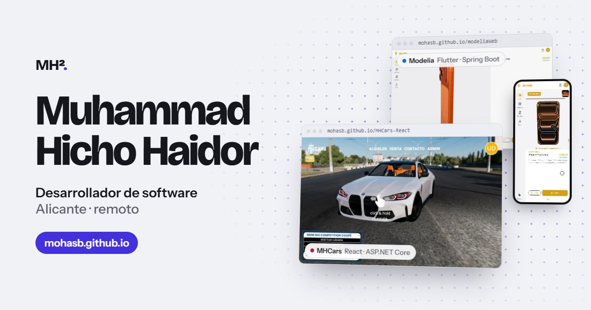
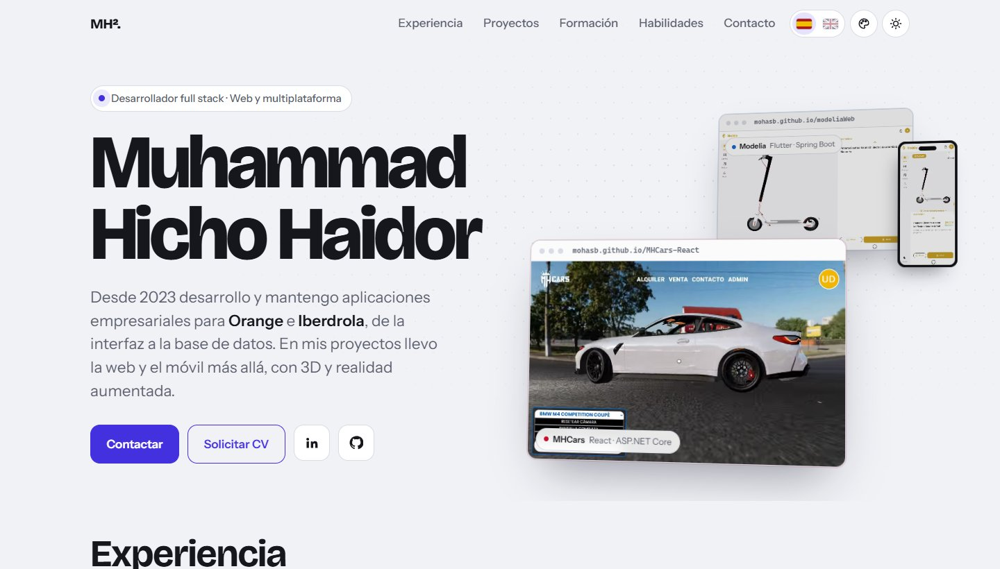

# Muhammad Hicho Haidor · Portfolio

[](https://mohasb.github.io)

**Web:** [mohasb.github.io](https://mohasb.github.io)

Portfolio profesional de Muhammad Hicho Haidor, desarrollador de software. Reúne mi experiencia en proyectos empresariales para Iberdrola y Orange (NTT DATA), mi formación y mis dos proyectos finales, **MHCars** (DAW) y **Modelia** (DAM). Los dos proyectos se pueden probar en vivo desde la propia página, sin instalar nada.



## Qué incluye

- **Demos en vivo integradas.** Cada proyecto se abre en una ventana de navegador dentro del portfolio, con vista de ordenador o de móvil. Las demos funcionan sin servidor: un backend simulado responde con el mismo formato que la API real.
  - [MHCars](https://mohasb.github.io/MHCars-React/): React y ASP.NET Core. Alquiler y venta de coches con showroom 3D.
  - [Modelia](https://mohasb.github.io/modeliaWeb/): Flutter y Spring Boot. Tienda multiplataforma con visor 3D y realidad aumentada.
- **Escaparate en la cabecera:** los dos proyectos en vídeo, MHCars en una ventana de navegador y Modelia en otra ventana y en un teléfono.
- **Diagramas animados de arquitectura** que muestran cómo viajan las peticiones entre el frontend, el backend y la base de datos de cada proyecto.
- **Vídeos de vista previa** con capítulos, grabados automáticamente a partir de las demos reales.
- **Bilingüe (español e inglés).** El idioma se elige automáticamente según el navegador.
- **Modo claro y modo oscuro**, y una paleta de colores opcional que cambia en cada visita, con el contraste WCAG comprobado.
- **Accesible y ligera.** HTML semántico, navegación con teclado, respeto a `prefers-reduced-motion` y diseño adaptado desde 360 px.

## Tecnología

Es una web estática, sin frameworks ni proceso de build. Se publica tal cual con GitHub Pages.

| Parte | Tecnología |
|---|---|
| Web | HTML, CSS (variables de diseño y temas) y JavaScript sin dependencias |
| Animaciones | Canvas 2D (fondo del hero), SVG (diagramas) y vídeo (escaparate de los proyectos) |
| Traducciones | Diccionario JS que se carga solo cuando hace falta |
| Herramientas | Node.js con Playwright y ffmpeg (vídeos e iconos), Python (paletas de color) |

## Estructura

```
index.html               Toda la web: estructura, estilos y código
assets/i18n/en.js        Textos en inglés (el español está en index.html)
img/                     Vídeos de vista previa, imágenes fijas e iconos
site.webmanifest         Nombre e iconos de la web en el móvil
og-image.jpg             Imagen al compartir el enlace (LinkedIn, WhatsApp…)
tools/preview/           Grabación de los vídeos y generación de iconos
tools/paletas/           Generador de las paletas de color
docs/guia.md             Guía de mantenimiento
docs/cabecera.jpg        Captura de la cabecera para este README
```

## Ejecutar en local

No hace falta instalar nada. Abre la carpeta en VS Code y usa la extensión **Live Server**, o cualquier servidor estático:

```bash
npx serve .
```

Para mantener o ampliar la web, consulta la [guía de mantenimiento](docs/guia.md).

## Contacto

[LinkedIn](https://www.linkedin.com/in/mhichohaidor) · [GitHub](https://github.com/Mohasb) · mhichoha@gmail.com
